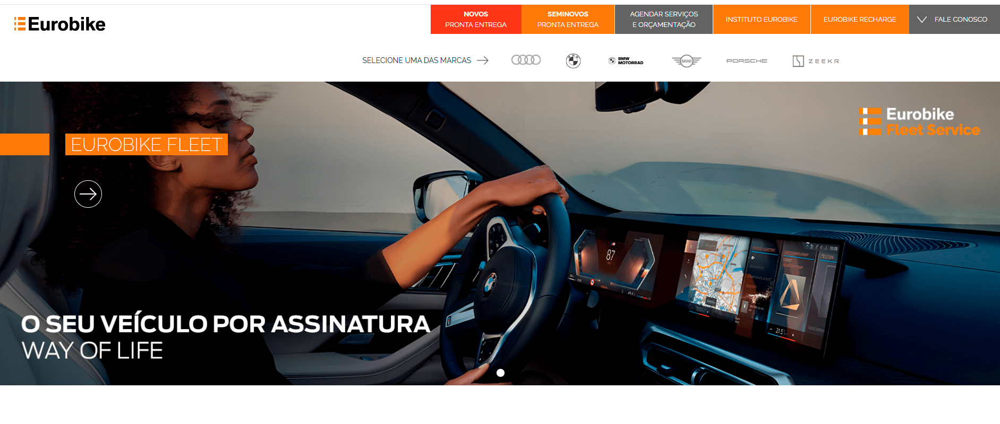

# Olá, sou a Michele Martins! 👋
### Front-End Developer | Angular & IA Generativa

Sou uma desenvolvedora apaixonada por criar interfaces que funcionam. Foco na modernização de sistemas, performance e experiência do utilizador (UX). Atualmente, combino código sólido com **Engenharia de Prompt** para acelerar entregas e garantir qualidade.

- 🔭 **Trabalho atual:** Desenvolvedora Front-End na JBKR WEB.
- 💼 **Especialidade:** Ecossistema Angular & Migração de Legados.
- 🌱 **Diferencial:** Uso de IA para otimização de código e produtividade.
- 📫 **Contacto:** michelem1309@gmail.com

---
### 🛠️ Tecnologias e Ferramentas

### ⚙️ Versionamento, Editores & Design

### 🤖 Inovação & Produtividade

---

## 🚀 Projetos em Destaque

### 🚗 Eurobike (Migração & Sustentação)
**O Desafio:** Migração e reestruturação completa de uma plataforma legada para o ecossistema Angular.
- **O que fiz:** Desenvolvimento de páginas dinâmicas, reestruturação de formulários e manutenção contínua da interface.
- **Techs:** Angular, TypeScript.

 

### 📱 Job Digital (Arquitetura Modular)
**O Desafio:** Desenvolver uma interface escalável com forte reaproveitamento de código.
- **O que fiz:** Criação de interface com arquitetura modular e desenvolvimento de componentes reutilizáveis.
- **Techs:** Angular, Bootstrap, HTML5 Semântico.

 

### 🏢 JBKR Web (Site Institucional)
**O Desafio:** Modernizar a interface corporativa com foco na atualização visual e arquitetura da informação.
- **O que fiz:** Desenvolvimento e modernização completa da interface, garantindo melhor usabilidade e apresentação técnica.
- **Techs:** JavaScript (ES6+), HTML5 Semântico, UI Modernização.

 

### ⚡ Ebkar (Reestruturação)
**O Desafio:** Reestruturar código legado focando em alta performance e otimização para motores de busca.
- **O que fiz:** Reestruturação focada em performance e otimização de SEO com abordagem Mobile-First.
- **Techs:** HTML5, CSS3, JavaScript.

 

### 💍 Sonho de Noivos (Desenvolvimento Greenfield)
**O Desafio:** Criar uma aplicação do zero (*Greenfield*) focada no segmento de eventos e casamentos.
- **O que fiz:** Desenvolvimento de interface com foco absoluto em layout fluido e design responsivo.
- **Techs:** HTML5, CSS3, UI Design.

### 💒 Site de Casamento (Jean & Michele)
**O Desafio:** Criar uma experiência digital única, interativa e totalmente personalizada para os convidados do próprio casamento.
- **O que fiz:** Desenvolvimento completo da interface, com forte foco num design emocional, layout responsivo (Mobile-First) e excelente usabilidade para facilitar a navegação dos convidados.
- **Techs:** HTML5, CSS3, UI/UX Design.

 

---

## 🧠 Visão de Produto & Diferenciais

- **Comunicação Visual & Usabilidade:** Expertise em estratégias de engajamento e comunicação visual, aplicadas diretamente à usabilidade e apresentação de interfaces técnicas.
- **Gestão & Resolução de Problemas:** Alta capacidade de organização e gestão de prazos na resolução de problemas técnicos complexos.

---
⭐️ *Vamos conectar no LinkedIn? [Clique aqui](https://www.linkedin.com/in/michelemartins/)*
