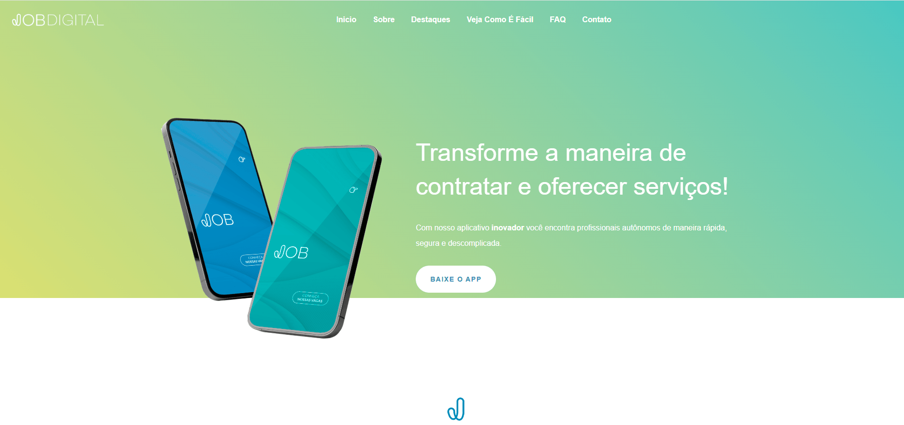
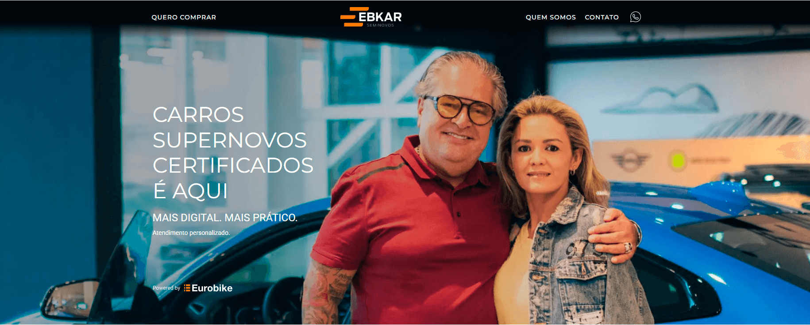

# Olá, sou a Michele Martins! 👋
### Front-End Developer | Angular & IA Generativa

Sou uma desenvolvedora apaixonada por criar interfaces que funcionam. Foco na modernização de sistemas, performance e experiência do utilizador (UX). Atualmente, combino código sólido com **Engenharia de Prompt** para acelerar entregas e garantir qualidade.

- 🔭 **Trabalho atual:** Desenvolvedora Front-End na JBKR WEB.
- 💼 **Especialidade:** Ecossistema Angular & Migração de Legados.
- 🌱 **Diferencial:** Uso de IA para otimização de código e produtividade.
- 📫 **Contacto:** michelem1309@gmail.com

---

## 🛠 Tech Stack

---

## 🚀 Projetos em Destaque

### 🚗 Eurobike (Migração & Sustentação)
**O Desafio:** Migrar uma plataforma legada completa para tecnologias modernas.
- **O que fiz:** Atuei na migração para o ecossistema **Angular**, desenvolvendo novas páginas dinâmicas e garantindo a manutenção.
- **Techs:** Angular, TypeScript.

 

### 📱 Job Digital (Arquitetura Modular)
**O Desafio:** Criar uma interface escalável com reaproveitamento de código.
- **O que fiz:** Desenvolvimento de arquitetura modular com componentes reutilizáveis.
- **Techs:** Angular, Bootstrap, HTML5 Semântico.

 

### 🏢 JBKR Web (Institucional)
**O Desafio:** Modernizar a cara da empresa com foco em performance.
- **O que fiz:** Atualização visual completa e reestruturação da arquitetura da informação.
- **Techs:** JavaScript (ES6+), HTML Semântico.

 

### ⚡ Ebkar (Reestruturação & SEO)
**O Desafio:** Otimizar um código legado para melhorar a performance e o ranqueamento no Google.
- **O que fiz:** Reestruturação completa do HTML/CSS com foco em Mobile-First e SEO Técnico.
- **Techs:** HTML5, CSS3, JavaScript.

 

### 💍 Sonho de Noivos & Wedding Platform
**O Desafio:** Criar experiências fluidas para gestão de eventos.
- **O que fiz:** Projetos focados na jornada do utilizador e design responsivo (Mobile First).
- **Techs:** HTML5, CSS3, UI Design.

---

## ⚡ Diferenciais
Não apenas escrevo código, eu otimizo o processo. Utilizo **Engenharia de Prompt** para:
1.  Gerar boilerplates de componentes Angular.
2.  Refatorar funções legadas para ES6+.
3.  Criar documentação técnica automática.

---
⭐️ *Vamos conectar no LinkedIn? [Clique aqui](https://www.linkedin.com/in/michelemartins/)*
